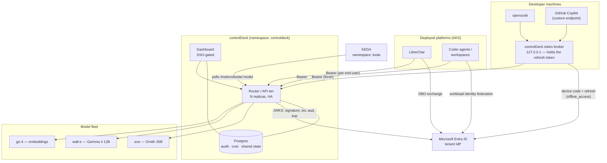
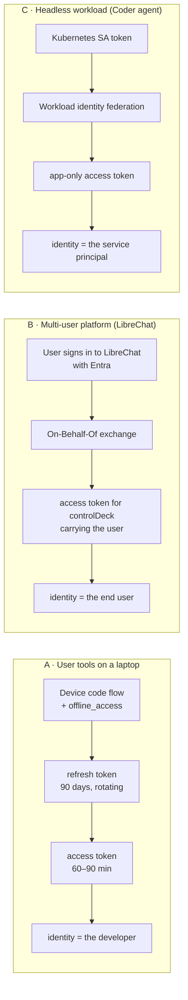
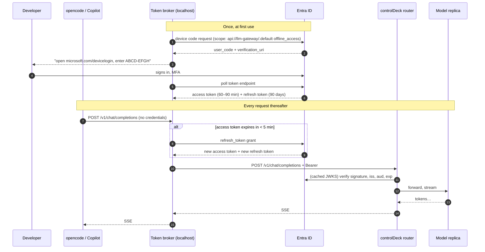
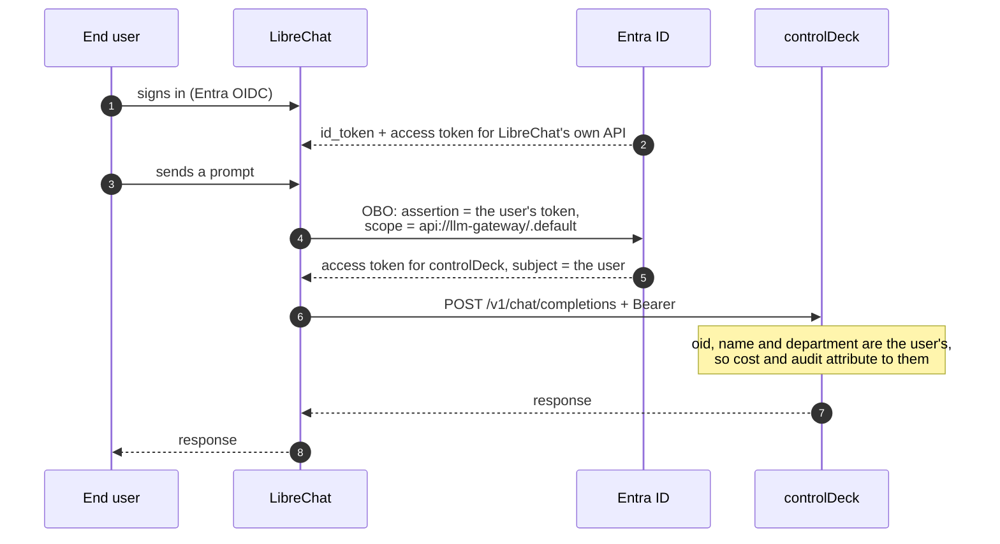
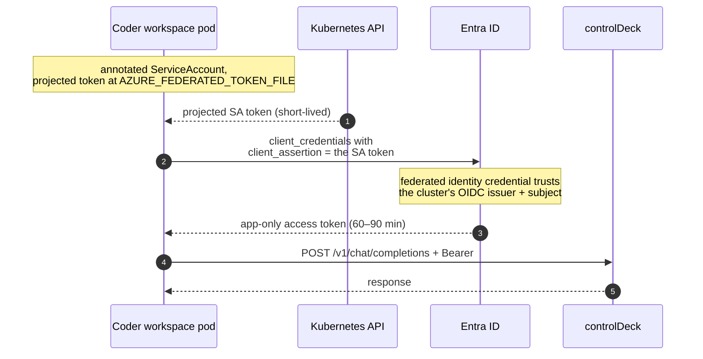
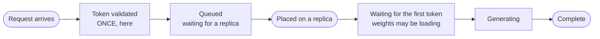

# Enterprise architecture

How callers authenticate, what talks to what, and which clock governs which
part of a request.

Every diagram here is Mermaid and renders on GitHub. Section references (§6.1,
§6.5) point at [`prd/llm-platform-prd.md`](../prd/llm-platform-prd.md).

For the practical "how do I connect my tool and stop it expiring mid-task",
see [client-authentication.md](client-authentication.md).

---

## 1. The whole system

Two things to read off this diagram. First, **controlDeck issues no
credentials** — every token is minted by Entra ID, and the gateway only
validates them (§6.1). Second, the platform's own trust boundary contains no
long-lived caller secrets: what it holds is a database, a registry, and a
connection to the model fleet.

### Trust boundaries

| Boundary | What crosses it | Guarded by |
|---|---|---|
| Laptop → Entra | user credentials, MFA | Entra, Conditional Access |
| Laptop → controlDeck | a bearer token, per request | JWKS signature + `aud` + `iss` + `exp` |
| Platform → Entra | federated or client assertion | Entra; **no secret on disk** with workload identity |
| controlDeck → models | plain HTTP inside the namespace | NetworkPolicy; the fleet is not exposed |
| KEDA → controlDeck | metric reads only | NetworkPolicy; the endpoint is unauthenticated by design |

The dashboard's `/api/*` surface is deliberately **not** published through the
ingress. It is unauthenticated, and the dashboard's own Entra session is what
guards it — publishing it would hand registry edits and audit deletion to
anyone who could reach the host.

---

## 2. How each client class gets a token

Three classes, three flows. The difference that matters is **whose identity
ends up in the audit trail**.

**Class C attributes every request to the service principal**, not to the human
who triggered it. That is fine for a batch job and wrong for anything a person
drives: per-team cost (§6.7) and per-team content-logging scopes (§6.8) both
key off the caller's claims. Where a human is attached to the work, prefer the
Class B exchange even from a deployed platform.

---

## 3. Sequence: a user tool, and why it never expires mid-task

**A token expiring mid-generation does not kill the request.** Authentication
is a Fastify `preHandler`: it runs once, when the request arrives. A 40-minute
generation that started with a valid token streams to completion even though
the token expired at minute 12. Expiry only decides whether the *next* request
is admitted — which is exactly what the broker's proactive refresh handles.

---

## 4. Sequence: LibreChat, preserving the end user

LibreChat is a confidential client, so its refresh tokens last 90 days and
rotate. It should cache per user and refresh on the same "expires in under five
minutes" rule as the broker.

---

## 5. Sequence: a Coder agent, with no secret anywhere

No client secret exists to leak or expire. MSAL caches the token and acquires a
new one when it ages out; there is no refresh token in this flow and none is
needed.

---

## 6. The clocks

Five different timers govern a request, and they are routinely confused with
one another. Only the first has anything to do with Entra.

| Clock | Default | Governs | Where it is set |
|---|---|---|---|
| Access token lifetime | 60–90 min (random) | whether a **new** request is admitted | Entra; `AccessTokenLifetime`, 10 min – 24 h |
| Refresh token | 90 days, rotating | how long a client works unattended | Entra; **not configurable** |
| Queue wait (§6.5) | 5 min | how long a request waits for free capacity | `QUEUE_TIMEOUT_MS` |
| First token | per model, e.g. 30 min | silence while a model loads its weights | `firstTokenTimeoutMs` |
| Stall / inactivity (§6.5) | 60 s | silence **after** generation has started | `STALL_TIMEOUT_MS` |

There is deliberately **no total-duration cap**. A slow 35B answer that keeps
producing tokens runs to completion, however long it takes.

The two model-side clocks are separate for a reason: a llama-swap container
loads weights on the first request naming a model and holds the connection
open, silently, for minutes. Judging that against the 60-second inactivity
threshold would kill precisely the requests that are behaving correctly, on
exactly the cold starts that autoscaling creates.

---

## 7. What controlDeck checks, and what it does not

Verified against [`server/src/auth/verify.ts`](../server/src/auth/verify.ts):

| Check | Behaviour |
|---|---|
| Signature | RS256 only, against the tenant JWKS. The algorithm is pinned — accepting whatever the key permits is how algorithm-confusion bugs start |
| `iss` | must equal `ENTRA_ISSUER` |
| `aud` | must be in `ENTRA_AUDIENCE` (a list, so two audiences can be accepted during a migration) |
| `exp` | enforced, with 60 s of clock tolerance |
| `tid` | enforced only when `ENTRA_TENANT_ID` is set — redundant with a tenant-pinned issuer |
| `oid` | **required**; it is what the audit trail keys on |
| `name` | optional, falls back through `preferred_username`, `upn`, `email`, then `oid` |
| team | read from `TEAM_CLAIM` (default `department`) |

**Not checked: `scp` and `roles`.** Any token with the right audience is
accepted, including app-only tokens. If you need to distinguish "may call the
gateway" from "merely exists in the tenant", enforce it in Entra by requiring
app-role assignment on the API's service principal — with *user assignment
required* set, Entra will not issue a token to an unassigned user at all.
